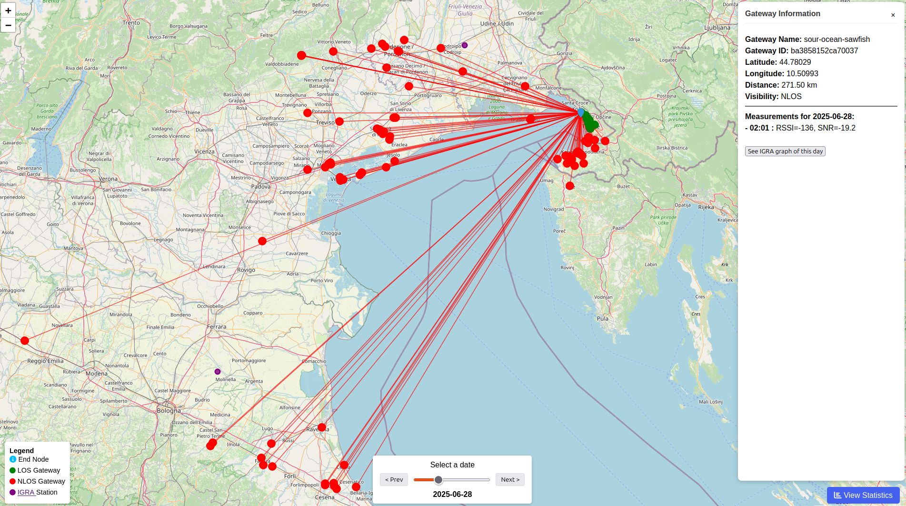

# 🌐 LoRa-Helium-Map

A Python toolkit to retrieve real-time data from a LoRaWAN end-node connected to the [Helium Network](https://www.helium.com/), process radiosonde observations ([IGRA v2](https://www.ncei.noaa.gov/products/weather-balloon/integrated-global-radiosonde-archive) or [ERA5](https://www.ecmwf.int/en/forecasts/dataset/ecmwf-reanalysis-v5)), compute atmospheric refractivity gradients, visualize potential tropospheric ducts, and make statistics.

<div align="center">
  
  <p><em>Interactive map with radio links and gradient graphs</em></p>
</div>

---

## Table of Contents

* [Features](#features)
* [Versions](#versions)

  * [Classic Python Version](#classic-python-version)
  * [Docker Version](#docker-version)
* [Repository Structure](#repository-structure)
* [Installation & Usage](#installation--usage)
* [Output Examples](#output-examples)
* [Releases](#releases)
* [License](#license)

---

## Features

* Real-time packet + gateway retrieval from Helium using a [Flask](https://flask.palletsprojects.com/en/stable/) webhook server and [LocalTunnel](https://theboroer.github.io/localtunnel-www/)
* Use SPLAT! to compute LOS, terrain profiles, and visibility
* Automatic IGRA station matching to each link
* Automatic ERA5 download and computing
* Compute refractivity (N) and vertical gradient (∆N/∆h)
* Detect tropospheric ducts based on gradients
* Generate vertical gradient graphs (PNG) :
  * On IGRA station for the day
  * _On demand_ for a gateway and its midpoint with end-node for the link's time (ERA5)
  * Of all coordinates for each hour of the day (ERA5)
* Render an interactive map with all radio links

---

## Versions

### Classic Python Version

> Standalone automated scripts. Automated Python, LocalTunnel and Splat! installation with `setup.sh`. Automated launch with `main.py`.

* [Latest release](https://github.com/Kellemensch/LoRa-Helium-map/releases/tag/v2.0.0)
* Uses: `generate_maps.py`, `calculate_igra.py`, `run_splat`, `run_localtunnel.sh`, `convert_hgt_to_sdf.sh`
* Outputs: `map.html`, PNG graphs, CSV LOS/NLOS (Line-of-sight) in `data/helium_gateway_data.csv` 

A `README.md` is available in the release.

### Docker Version

> Fully containerized. Ideal for easy deployment, reproducibility, and automation. No need to be root.

* [Docker release](https://github.com/Kellemensch/LoRa-Helium-map/releases/tag/v3.0.0)
* Run with a single script (`run.sh`)
* Background process with logs streaming with `docker logs -f lora-map`
* Automated updates of new realases with [Watchtower](https://github.com/containrrr/watchtower) container
* Outputs are identical, but no setup needed on host (except Docker). Data are in `output/data/helium_gateway_data.csv`

See full [Docker installation & configuration guide](./docs/README_docker.md) (available in release)


---

## Repository Structure

```
/data/               # Helium data and terrain models for SPLAT!
  ├── terrain/       # QTH terrain files
  ├── helium_data_msg.txt
  └── helium_gateway_data.csv
/igra-datas/         # Radiosonde (IGRA) datasets and analysis
  ├── derived/       # Generated gradient graphs
  ├── igra2-station-list.txt
  └── map_links.json
/maps/               # SPLAT! terrain and map files (.sdf/.hgt)
/splat-runs/         # SPLAT! outputs (LOS, profiles)
  ├── img/
  └── EndNode-to-*.txt
/examples/           # Example outputs (map + gradient graph)
/venv/               # Python virtual environment (classic version)
/docker/             # Dockerfile and helper scripts (new version)
  └── run.sh
main.py              # Webhook + full processing loop
generate_maps.py     # Generate interactive maps
calculate_igra.py    # Compute gradients from IGRA files
run_splat.py         # Automate SPLAT! execution
convert_hgt_to_sdf.sh# Terrain conversion tool
setup.sh             # Auto-dependency installer (classic)
/README.md
```

---

## Installation & Usage

### Classic Version

1. Clone the repo:

   ```bash
   git clone https://github.com/Kellemensch/LoRa-Helium-map
   cd LoRa-Helium-map
   ```

2. Run setup script:

   ```bash
   bash setup.sh
   ```

3. Launch main script:

   ```bash
   python3 main.py
   ```

   Or with logs:

   ```bash
   python3 main.py --logs
   ```

---

### Docker Version

1. Build and run the container:

   ```bash
   bash run.sh
   ```

2. The container runs in background and streams logs. You can see them with :

   ```bash
   docker logs -f lora-map
   ```


> All outputs (map, graphs) will appear in the mounted volumes, same as the classic version.

---

## Output Examples

### Interactive Map



### Refractivity Gradient Graph


---

## Releases

* [All Releases](https://github.com/Kellemensch/LoRa-Helium-map/releases)
* [Docker Release](https://github.com/Kellemensch/LoRa-Helium-map/releases/tag/v3.0.0)
* Each release corresponds to a stable state of the repo (Classic / Docker)

---

## License

MIT License.
