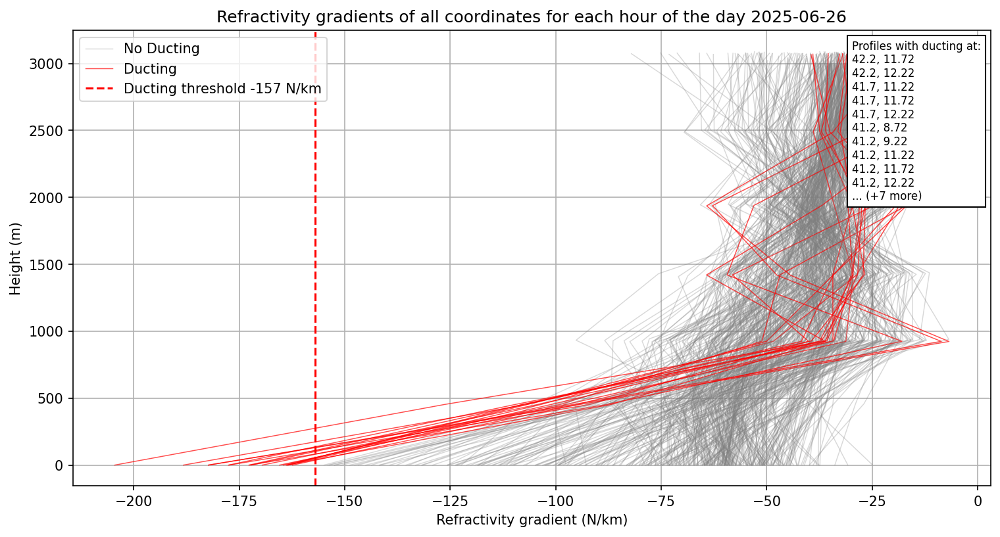
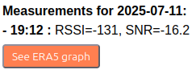
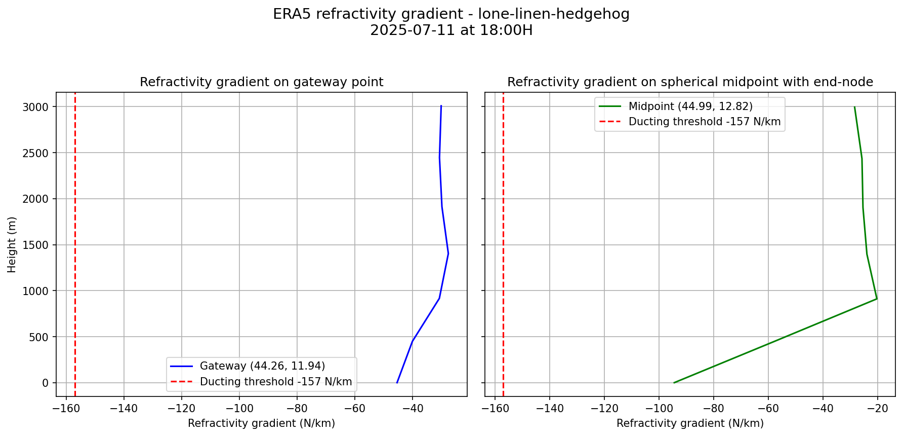
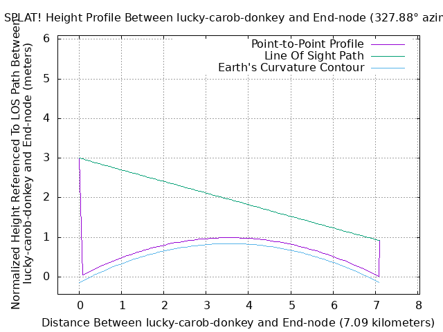
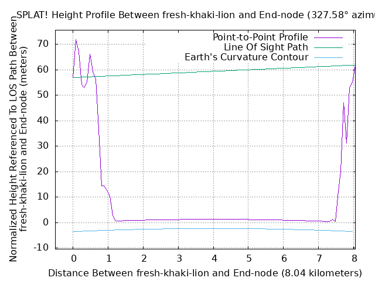
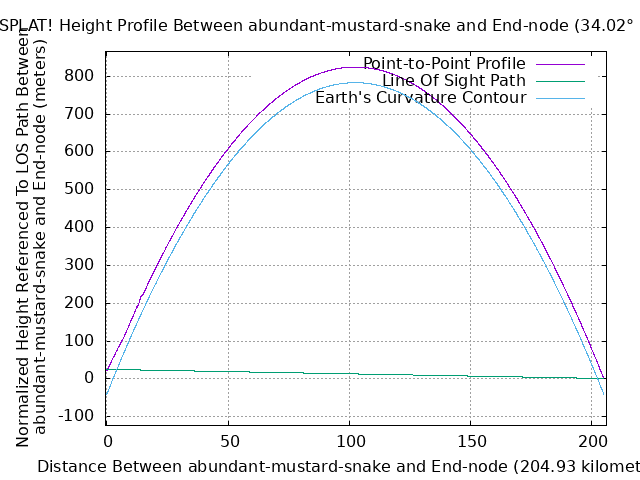

# Docker Documentation

The Docker repository can be found in DockerHub [here](https://hub.docker.com/repository/docker/kellemensch/lora-helium-map/general).

--- 

## Containers used 

This project uses a total of 2 containers:

* The application `app` : from main repository `kellemensch/lora-helium-map:latest`
* A Watchtower to automate updates: from `containrrr/watchtower` - [See GitHub repo](https://github.com/containrrr/watchtower)

---

## Available files

### docker-compose.yaml

```yaml
services:
  app:
    build:
      context: .
      args:
        USER_ID: ${LOCAL_UID}
        GROUP_ID: ${LOCAL_GID}
    image: kellemensch/lora-helium-map:latest
    container_name: lora-map
    ports:
      - "5000:5000"
    volumes:
      - ./output:/app/output
      - ./configs:/app/configs
    restart: unless-stopped

  watchtower:
    image: containrrr/watchtower
    container_name: watchtower
    volumes:
      - /var/run/docker.sock:/var/run/docker.sock
    environment:
      - WATCHTOWER_CLEANUP=true
      - WATCHTOWER_POLL_INTERVAL=300  # Every 5 minutes
    restart: unless-stopped
```

The `docker-compose` file starts these two containers by making sure the output files created by the application are user files and not root files (in order to keep it rootless). 

Then it creates two volumes:

* `output/` folder to save and plot the results
* `configs/` folder containing the python module that returns the end-node's coordinates

### run.sh

This scripts automates the configuration for the docker. It makes you create the coordinates of your end-node and the subdomain you want to use for your webhook (same as the one in Helium integration) and for the website exposure.

The coordinates are written into `configs/.latitude` and `configs/.longitude`, and the subdomain into `configs/.subdomain`.

Then it sets two environment variables `LOCAL_UID` and `LOCAL_GID` so that Docker can retrieve them from the docker-compose.

Finally, it launches the pull from DockerHub and starts the containers.

---

## Files in Docker application image

### main.py

The main script running all processes. At first launch, it runs all the useful files:

* `download_terrain` and `convert_hgt_to_sdf`: to download and convert all the files needed for Splat!
* `run_localtunnel`: to prepare and run the LocalTunnel with the given subdomain
* `webhook_server`: to create the Flask server linked to the LocalTunnel
* `calculate_igra`: to compute IGRA calculations and downloads
* `era5_gradients`: to compute ERA5 calculations and downloads
* `run_splat` and `generate_maps`: to make Splat! computations and generate the map.html 
* `main_stats`: to calculate statistics and plot graphs

This script stores the processes launched to ensure a clean shutdown without leaving any processes still running or blocked.

Then it fixes the ownership of folder `output` created to be owned by actual user.

Calculations are scheduled and relaunched several times in throughout the day:

* Every 5 minutes for the Splat! computation and map.html writing (because end-node receives every 5 minutes)
* Twice a day (every 12 hours) for the IGRA computation
* Once a day (every 24 hours) for the ERA5 computation and for the statistics

### download_terrain.py

This script is the first one launched and is used to download useful files (`.sdf` files) in order to the good use of Splat!.

The [Shuttle Radar Topography Mission (SRTM)](https://en.wikipedia.org/wiki/Shuttle_Radar_Topography_Mission) files are all downloaded from <https://www.usgs.gov/> by [this mirror site](https://srtm.kurviger.de/SRTM3) as the USGS dataset is now unavailable.

The script first take all tiles around for 3 degrees and guesses the region of the end-node (Africa, Australia, Eurasia, Islands, North-America, South-America) in order to go to the right directory for download.

Then it downloads files named for example `N16E073.hgt.zip` at <https://srtm.kurviger.de/SRTM3/Eurasia/N16E073.hgt.zip> and unzip them under `/app/maps`.

### convert_hgt_to_sdf.sh

Used to convert the files downloaded by `download_terrain.py` into `SDF` (SPLAT Data Files) under `/app/maps` using the tool `srtm2sdf` from Splat!. (See [Splat! Documentaion](https://www.qsl.net/kd2bd/splat.pdf))

See [How to use splat](https://fedoraproject.org/wiki/User:Jjmcd/Drafts/How_to_use_splat)

### run_localtunnel.sh

Launches and maintain the [LocalTunnel](https://theboroer.github.io/localtunnel-www/).

Runs continuously and checks every minute if the tunnel is working by curling the URL, if not it then relaunches the tunnel.

The tunnel is working on `localhost:5000`.

### webhook_server.py

This is the core of the application: the Flask server used as a webhook to retrieve data from <https://console.helium-iot.xyz> and to serve the generated maps online through the tunnel.

It was first implemented by Marco RAINONE to test the retrieval of Helium data.

It serves a server on `localhost:5000`. Helium data are automatically retrieved by using the HTTP integration (see [doc](./README_docker.md)) on the endpoint `helium-data` and filled in the `data/helium_gateway_data.csv`. The home route `/` only returns 'OK' to test the proper functioning with the previous script.

A static map.html created can be served on `/map` but it is deprecated. Prefer using the route `/dynamic-map` that returns a simple HTML file using JavaScript fetchs to call the `/api` endpoint and retrieving useful data from the dataset.

The script `dynamic_map.js` first fetch the configuration (coordinates of end-node) and all the gateway links, but in an optimized way, as well as the IGRA stations to show.

This script also serves a route `/logs` to download the logs file of the application.

Statistics are available at `/stats`.

All other routes are used by the JavaScript to serve data or graphs.

Here are all the routes created:

* /helium-data
* /api
    * /api/optimized_gateways
    * /api/dates
    * /api/igra_stations
    * /api/gateways
    * /api/config
    * /api/era5_graph : used with arguments (lat, lon, date, time)
    * /api/era5_daily_graph : used with argument (date)
* /dynamic-map
* /map
* /app/output/igra-datas/derived/<path:filename\>
* /plots/<path:filename\>
* /plots
* /stats


Note: Fetching the requested data for the requested day every time may take huge time and is not optimized. That is why the script is fetching all data once.

### calculate_igra.py

For detailled information about Integrated Global Radiosonde Archive (IGRA) version 2.2 see the [doc](https://www.ncei.noaa.gov/data/integrated-global-radiosonde-archive/doc/) and [README](https://www.ncei.noaa.gov/data/integrated-global-radiosonde-archive/doc/igra2-readme.txt).  
Here, the 'derived' section of this dataset is used as it gives directly refractivity measurements for each height.

This script is used to automate the download of all useful data from FTP directory from National Centers for Environmental Information (NCEI).  
At the start of each launch, it makes sure to delete all old files in order to get the latest data.  
It gets the `igra2-station-list.txt` which lists all the station available and their last updates.  
Then, for each row of the dataset (corresponding to each link with gateways) it computes the spherical midpoint between this gateway and the end-node in order to find the nearest IGRA radiosonde to this point and download its latest data.
The file contains all data from the beginning of the radiosonde's life until the last update (usually the day before), so this script parse the file to get all data for refractivity for all heights at the requested date.

Finally, gradients are calculated and plotted into `output/igra-datas/derived/`, and a utility file `output/igra-datas/map_links.json` is created.  
This file is used to better and easily generate the static map.html (deprecated) by linking all gateways to their coordinates, nearest station, and URL path for graphs for all days.  
Its structure is like:
```json
{
    "gatewayID": {
        "gateway_name": name,
        "gateway_coords": [lat, lon],
        "station_id": IGRA_id,
        "station_coords": [lat, lon],
        "midpoint": [lat, lon],
        "graphs": {
            "2025-06-06": "/app/output/igra-datas/derived/gradient_gatewayName_2025-06-06.png",
            ...
        }
    },
    ...
}
```

Graph plotted contain a small description on their values about different ducting cases (see `describe_ducting_case()`).

A cache file `output/processed_gradients.json` is used to store already processed links in our dataset, so that for each relaunch, the script only compute new data.
Its structure is something like:
```json
{
    "gatewayName1": [
        "date1",
        "date2",
        ...
    ],
    "gatewayName2": [
        "date1",
        ...
    ],
    ...
}
```

Links that are noted `LOS` (in Line-Of-Sight) are skipped here as their graph are not useful in this research.

### era5_gradients.py

This script is the latest to have been created.  
It computes refractivity gradients in addition of IGRA data. It was thought to add more precise data in term of localisation and time as there are not so many IGRA stations around Europe.

The dataset used for this project is the [ERA5 hourly data on pressure levels from 1940 to present](https://cds.climate.copernicus.eu/datasets/reanalysis-era5-pressure-levels?tab=download). (see [Documentation of ERA5](https://confluence.ecmwf.int/display/CKB/ERA5:+data+documentation))  
Note: Daily updates for ERA5T are available about 5 days behind real time.

An API is available with this ERA5 dataset and it is used in python with the module `cdsapi` (see [Documentation of API](https://cds.climate.copernicus.eu/how-to-api)).

The basic utility of this script is to create a refractivity graph for each day with all available data. This means that it draws a gradient curve for each coordinate at each hour.  
Gradients that exceed the ducting threshold are displayed in red and annotated next to them.

Here is an example of a daily gradient:

<figure markdown="span">
  { width="100%" }
  <figcaption>Daily ERA5 refractivity graph</figcaption>
</figure>

Downloaded data are in [GRIdded Binary (GRIB)](https://en.wikipedia.org/wiki/GRIB) format and downloaded individually for each day via the API.  
Data are for these pressure heights (in hPa): 1000, 950, 900, 850, 800, 750, 700; and for every two hours.  
In order to use the API, a config file `~/.cdsapirc` must be created and filled with these information (automated by the file):

```python
cds_url = "https://cds.climate.copernicus.eu/api"  
cds_key = "799f5ea7..."
```
For this project, my personal cds_key is used.

Another feature of this script is available: the _on demand_ graph. This is called by the map's JavaScript by clicking on the button.  

<figure markdown="span">
  { width="90%" }
  <figcaption>ERA5 on demand button</figcaption>
</figure>

This feature render two refractivity graphs by reading the corresponding GRIB file of the day and parsing it to find the requested hour (or the closest one).  
Rendered graphs are for the actual coordinates of the gateway and for the spherical midpoint between this gateway and the end-node, to remain consistent with IGRA's approach.  


<figure markdown="span">
  { width="100%" }
  <figcaption>On demand ERA5 graph</figcaption>
</figure>

Note: Daily graphs are computed locally before exposing the map online, whereas _on demand_ graphs are computed at the time of the call and will be stored locally until the next scheduled launch.

### run_splat.py

This script is used to make Splat! calls and create utility files for it to properly run.

In the dataset of the links, every link is initially attributed `N/A` to the column `visibility`. This script is used to fill this column by either _LOS_ (in Line-Of-Sight) or _NLOS_ (not in Line-Of-Sight) depending on wheter the Line-Of-Sight is blocked by the Earth curvature or any object (mountains etc).

For each gateway, it creates a _Site Location_ (QTH) file containing the site's name, latitude, longitude and height above ground level, each separated by a single line-feed character.  
__Caution:__ I have found that Splat! needs the longitudes to be written like this : __lon = 360 - lon__

Here is an example of a QTH file named `abundant-mustard-snake.qth`:

```
abundant-mustard-snake
44.1856944607886
347.75593422313324
3m
```

Then, it runs Splat! in terrain profile mode with point-to-point analysis to perform line-of-sight terrain analysis between the end-node and the gateway's location. (see [Documentation](https://www.qsl.net/kd2bd/splat.pdf))  
The command is `splat -t tx_site.qth -r rx_site.qth` with tx_site being the end-node so `end_node.qth` and rx_site being the gateway.

Finally, it parses the analysis report text file by checking if the line "detected obstructions at" is present in it.

Here are some examples of terrain analysis graphs returned by Splat:

<figure markdown="span">
  { width="80%"}
  <figcaption>In line of sight gateway (not blocked by environment)</figcaption>
</figure>
<figure markdown="span">
  { width="80%"}
  <figcaption>Not in line of sight gateway (blocked by environment)</figcaption>
</figure>
<figure markdown="span">
  { width="80%"}
  <figcaption>Not in line of sight gateway (blocked by Earth's curvature)</figcaption>
</figure>

### generate_maps.py

This script is deprecated. It was first used to create the static map.html containing all necessary data to show the map.

### main_stats.py

This script groups and manages all other scripts to calculate statistics in the `study-correlation/` folder: 

* igra_ducts.py: for each day, detects all ducts with their minimal gradient, base height, top height and thickness and put it in `igra_ducts.csv`
* daily_stats.py: for each day, calculates the total number of links, NLOS links, calculates NLOS ratio, average distance, maximum distance and number of different gateways and put it in `daily_propagation_stats.csv`
* merge_data.py: just merge the two above dataset into one `merged_data.csv`
* correlation.py: compute different type of correlation and plot results in `/app/web/static/stats/`. All these graphs are available at the `/stats` endpoint. Correlations are: Temporal analysis, Pearson correlation, Spearman correlation, linear regressions and correlation matrix.