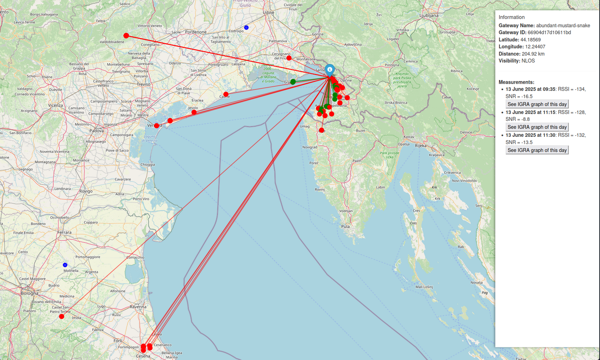
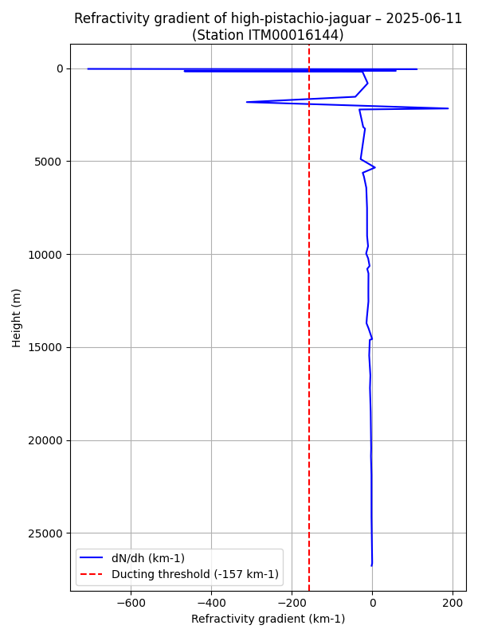

# Portable python version setup

The portable python version has not been updated since this [last release](https://github.com/Kellemensch/LoRa-Helium-map/releases/tag/v2.0.0).

---

## Prerequisites

You need to have an end-node connected to the Helium Network and create an HTTP integration on your application.  
Simply put the address you want to use for your LocalTunnel and remember it or write it down.

Please follow the section [Helium network setup](README_docker.md#helium-network-setup) of the Docker documentation.

---

## Installation

Go to the [release](https://github.com/Kellemensch/LoRa-Helium-map/releases/tag/v2.0.0) and download the source zip and unzip it.  
Then run   
```bash
cd LoRa-Helium-map
source setup.py yoursubdomain
```

With `yoursubdomain` being the subdomain you provided in your Helium HTTP integration.  
You will be asked to write your end-node's latitude and longitude.

---

## Launch

To launch the application, just run:  
```bash
python3 main.py
```

Or with logs showing on shell:  
```bash
python3 main.py --logs
```

---

## Results

The output map will be generated as `map.html` nad can be open with a web browser.

All the gradients graphs can be found in `igra-datas/derived/`.

---

## Example Output

<figure markdown="span">
  { width="100%"}
  <figcaption>Interactive map example</figcaption>
</figure>


<figure markdown="span">
  { width="100%"}
  <figcaption>IGRA gradient example</figcaption>
</figure>